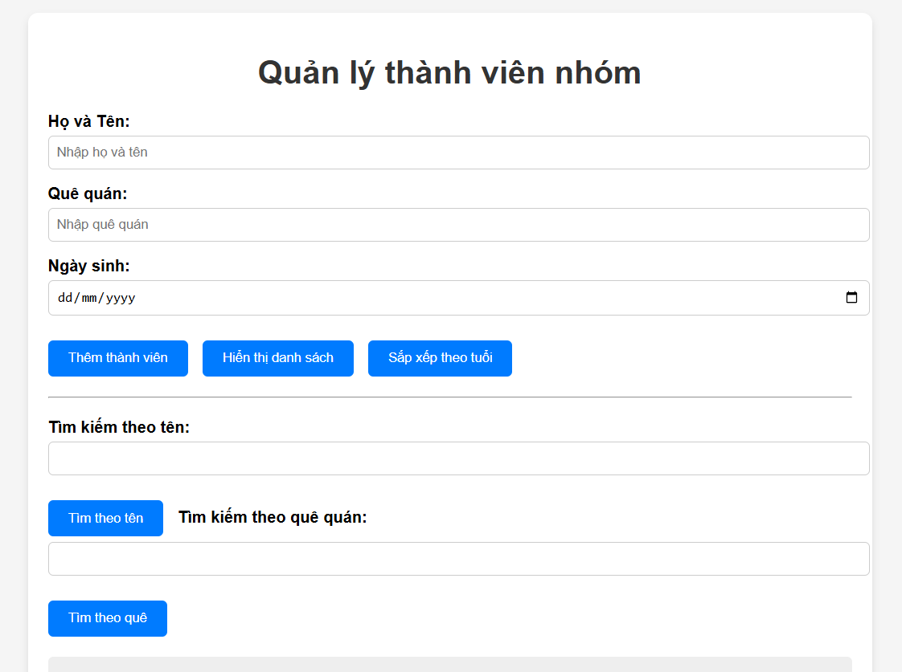
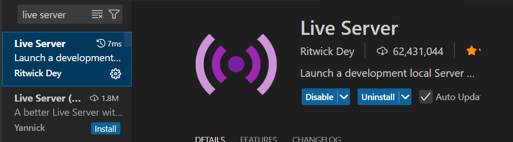

# Bài tập nhóm: Quản lý thành viên nhóm
FIle này sẽ hướng dẫn các bạn cài đặt và hiểu về cách thức xây dựng 1 trang web tĩnh 1 cách đơn giản nhất
## Giao diện web quản lý thành viên nhóm

## Yêu cầu cài đặt
+ Git (https://git-scm.com/downloads)
+ Vscode (https://code.visualstudio.com/download)
+ extension: Live server(để chạy web tĩnh)

## Hướng dẫn cài đặt
Mở cmd(command prompt) để tải repository về máy
