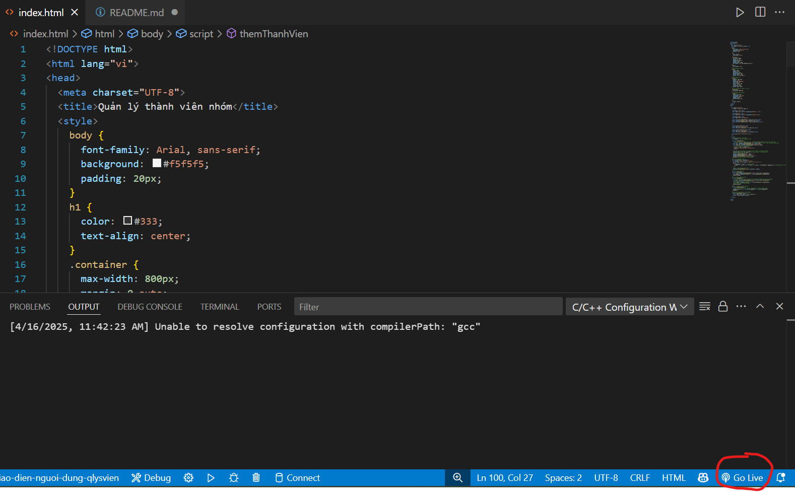
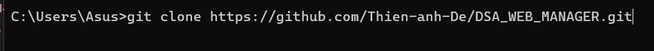

# Bài tập nhóm: Quản lý thành viên nhóm
FIle này sẽ hướng dẫn các bạn cài đặt và hiểu về cách thức xây dựng 1 trang web tĩnh 1 cách đơn giản nhất
## Giao diện web quản lý thành viên nhóm

## Yêu cầu cài đặt
+ Git (https://git-scm.com/downloads)
+ Vscode (https://code.visualstudio.com/download)
+ extension: Live server(để chạy web tĩnh)

## Hướng dẫn cài đặt
- Cài đặt git như các ứng dụng bình thường
- Mở cmd(command prompt) để tải repository về máy
```
git clone https://github.com/Thien-anh-De/DSA_WEB_MANAGER.git
```
Hiện tại file đang ở ổ C, trong thư mục Asus của User

- Tiếp tục vào file, open folder trong vscode
- Tại file có tên "index.html" bạn hãy bấm vào ô có chữ "Go Live" để có thể chạy trang web

## Hướng dẫn sử dụng trang web
Trang web có những chức năng như 
- Thêm thành viên
- Hiện thị các thành viên hiện có trong danh sách
- Sắp xếp các thành viên theo độ tuổi
- Tìm kiếm theo tên hoặc quê quán( không phân biệt hoa thường)
## Làm sao để có thể tạo nên 1 trang web tĩnh
-  Học ngôn ngữ HTML cơ bản( mình cũng không chắc đây là 1 ngôn ngữ :))
- Học CSS cơ bản
- P/S: Nếu HTML là 1 căn nhà trống không thì CSS là cách bạn trang trí ngôi nhà đó <3
- Ngoài ra cần có kiến thức về Javascript( trong file này mình có tra mạng từ nguồn code c++ mình có để trong file rồi )
## Lời kết
Nhóm 2 xin chân thành cảm ơn thầy và các bạn đã ghé thăm <3
Mọi đóng góp xin gửi qua GitHub issues hoặc pull requests. Nhóm 2 xin chân thành cảm ơn!